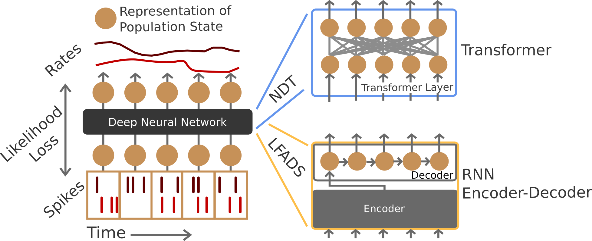

# Neural Data Transformers
<p align="center">
    
</p>

This is the code for the paper "Representation learning for neural population activity with Neural Data Transformers". We provide the code as reference, but we are unable to help debug specific issues e.g. in using the model, at this time. NLB-related configuration files are listed directly under `configs/`, whereas original NDT paper configs are under `configs/arxiv/`.

- Want to quickly get started with NLB? Check out `nlb_from_scratch.py` or `nlb_from_scratch.ipynb`.

## Setup
We recommend you set up your code environment with `conda/miniconda`.
The dependencies necessary for this project can then be installed with:
    `conda env create -f nlb.yml`
This project was developed with Python 3.6, and originally with `environment.yml`. `nlb.yml` is a fresh Python 3.7 environment with minimal dependencies, but has not been tested for result reproducibility (no impact expected).

## Data
The Lorenz dataset is provided in `data/lfads_lorenz.h5`. This file is stored on this repo with [`git-lfs`](https://git-lfs.github.com/). Therefore, if you've not used `git-lfs` before, please run `git lfs install` and `git lfs pull` to pull down the full h5 file.

The autonomous chaotic RNN dataset can be generated by running `./data/gen_synth_data_no_inputs.sh`. The generating script is taken from [the Tensorflow release](https://github.com/tensorflow/models/tree/master/research/lfads/synth_data) from LFADS, Sussillo et al. The maze dataset is unavailable at this time.

## Training + Evaluation
Experimental configurations are set in `./configs/`. To train a single model with a configuration `./configs/<variant_name>.yaml`, run `./scripts/train.sh <variant_name>`.

The provided sample configurations in `./configs/arxiv/` were used in the HP sweeps for the main results in the paper, with the sweep parameters in `./configs/*json`. Note that sweeping is done with the `ray[tune]` package. To run a sweep, run `python ray_random.py -e <variant_name>` (the same config system is used). Note that main paper and NLB results use this random search.

R2 is reported automatically for synthetic datasets. Maze analyses + configurations are unfortunately unavailable at this time.

## Analysis
Reference scripts that were used to produce most figures are available in `scripts`. They were created and iterated on as VSCode notebooks. They may require external information, run directories, even codebases etc. Scripts are provided to give a sense of analysis procedure, not to use as an out-of-the-box reproducibility notebook.

## Citation
```
@article{ye2021ndt,
	title = {Representation learning for neural population activity with {Neural} {Data} {Transformers}},
	issn = {2690-2664},
	url = {https://nbdt.scholasticahq.com/article/27358-representation-learning-for-neural-population-activity-with-neural-data-transformers},
	doi = {10.51628/001c.27358},
	language = {en},
	urldate = {2021-08-29},
	journal = {Neurons, Behavior, Data analysis, and Theory},
	author = {Ye, Joel and Pandarinath, Chethan},
	month = aug,
	year = {2021},
}
```
